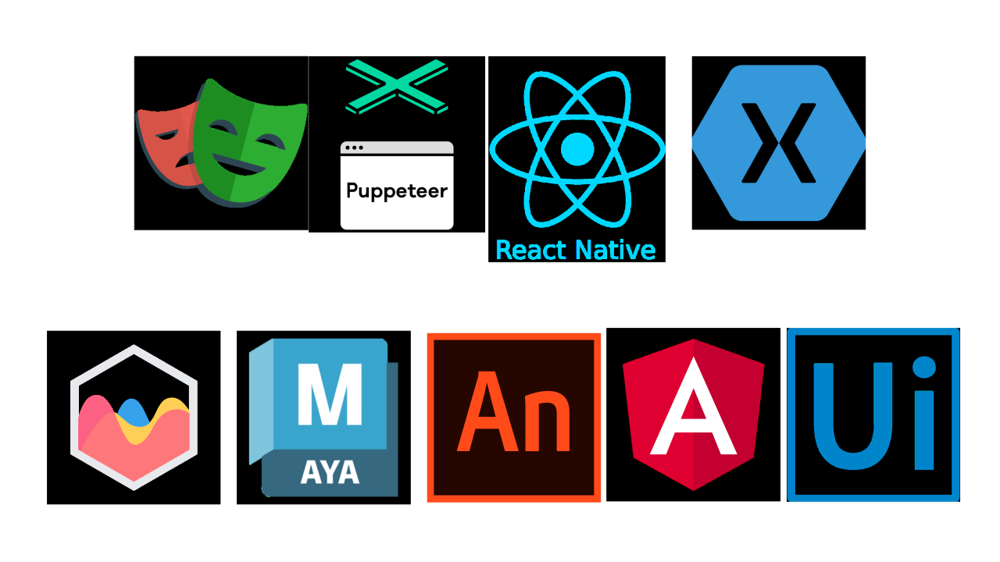

  

<h1 align="center">
  
</h1>

  <em><b>“I develop systems that solve real-world problems — efficiently, securely, and elegantly.”</b></em>

  
  
  

  

---

<h2 align="center">🚀 Current Focus & Projects</h2>

<ul>
  <li>
    🏗️ <b>Enterprise Grade Backend System:</b> Architecting a massive-scale production system.
    <ul>
      <li><b>Tech:</b> Polyglot architecture, <b>RabbitMQ</b>, <b>Redis</b>, distributed caching</li>
      <li><b>Goal:</b> High availability, extreme scalability, and rock-solid security</li>
    </ul>
  </li>
  <li>
    🤖 <b>FRC Robotics:</b> Proudly contributing to <b>FRC Team #6038</b>, developing robust control systems and high-performance embedded code
  </li>
  <li>
    🛍️ <b>Modern E-Commerce Engine:</b> Building a full-stack experience with <b>NestJS + React</b>, focused on modular architecture and seamless user journeys
  </li>
</ul>

---

<h2 align="center">💻 About Me</h2>

- 🌱 <b>Learning Path:</b> Mastering <code>Go</code> for high-performance microservices and <code>Angular</code> for enterprise-grade frontend consistency
- 💬 <b>Ask me about:</b> C#, Python, Web Automation, MVC, JavaScript, React.js
- 📫 <b>Reach me:</b> <a href="mailto:isikdunya5@gmail.com">isikdunya5@gmail.com</a>

---
<h2 align="center">🧠 Languages & Tools</h2>

<i>Technologies I use to architect, build, and scale systems</i>

  
<b>🏗️ Development & Frameworks</b>

   
  

    
  

  
<b>💾 Data, Cloud & DevOps</b>

   
  

    
  

  
<b>🛠️ Testing, Automation & Tooling</b>

   
  

    
  

  

    
  

---

<h2 align="center">🌐 Connect With Me</h2>

  
  
  

---

<h2 align="center">📊 GitHub Analysis</h2>

  
  

  
  

  

---

<h2 align="center">💬 Random Developer Insight</h2>

  

  

    <em>“Sometimes I debug my own thoughts — not just my code.”</em> 
    <strong>— Işık Dünya Erdin —</strong>
  

   
  

